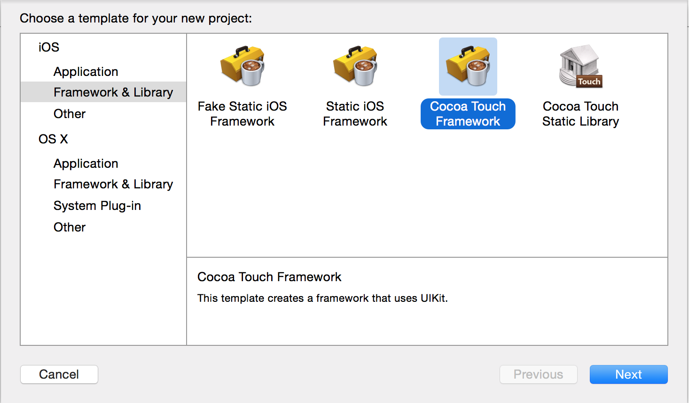
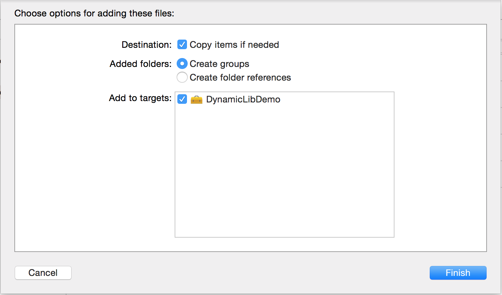
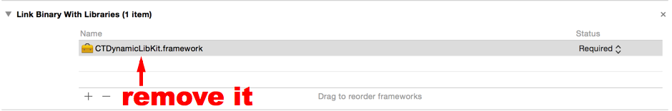
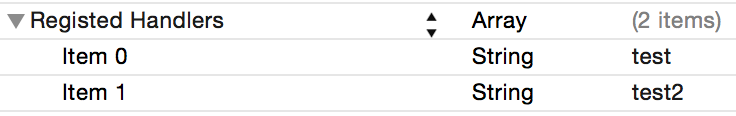
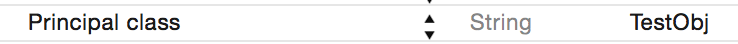

# CTDynamicLibKit
Dynamic Library Kit

## Why to use CTDynamicLibKit?

CTDynamicLibKit is a dynamic library, which can load your customized dynamic library that delivered with your app or even fetched by network.

CTDynamicLibKit provided some methods to load and maintain your dynamic libraries and to call methods(in CTDynamicLibKit, I prefer to call it handler.) from your customized dynamic library.

## Quick Try

1. `cd ./Demo/DynamicDemo` and `pod update`, so that you can use `NVHTarGzip` to extract the framework you will download by network.
2. `cd ./Demo/DynamicLibDemo` and `open DynamicLibDemo.xcodeproj`, press `Command+b` to build it
3. go to `Derived Data`, find the builded `DynamicLibDemo.framework`, then `cd DynamicLibDemo.framework`, use `tar zcvf ../a.tar.gz ./`, and `cd ..` you will see the `a.tar.gz` generated.
4. upload `a.tar.gz` to your own website so that you will have a download URL which looks like `http://1.2.3.4/a.tar.gz`.
5. `open ./Demo/DynamicDemo.xcodeworkspace`, modify `ViewController.m:47` to the correct URL you just generated.
6. press `Command+r` to run DynamicDemo, and wait a few seconds, your app will download and load the framework you just uploaded, and show a UIAlertView.

## How to create your custmized dynamic library?

1. create a new XCode project, and choose `Cocoa Touch Framework`.



2. drag the compiled `CTDynamicLibKit` into your project, copy if needed 



3. go to `Build Phases` of your `Targets`, remove `CTDynamicLibKit.framework` from `Link Binary With Libraries`.



4. create a Class, let's say it `TestObj`, which import `<CTDynamicLibKit/CTDynamicLibKit.h>` and conforms to protocol `CTDynamicLibPrincipalClassProtocol`, and implement them.

```
/** TestObj.h **/

#import <UIKit/UIKit.h>
#import <CTDynamicLibKit/CTDynamicLibKit.h>

@interface TestObj : NSObject <CTDynamicLibPrincipalClassProtocol>

@end


/** TestObj.m **/

#import "TestObj.h"

@implementation TestObj

#pragma mark - CTDynamicLibPrincipalClassProtocol
+ (instancetype)sharedInstance
{
    static TestObj *_testObj = nil;
    static dispatch_once_t onceToken;
    dispatch_once(&onceToken, ^{
        _testObj = [[TestObj alloc] init];
    });
    return _testObj;
}

- (void)performHandler:(NSString *)handler
            withParams:(NSDictionary *)params
    processingCallback:(NSDictionary *(^)(NSDictionary *))processingCallback
            completion:(void (^)(NSDictionary *, NSError *))completion
{
    UIAlertView *alert = [[UIAlertView alloc] initWithTitle:@"casa" message:@"casa" delegate:nil cancelButtonTitle:@"ok" otherButtonTitles:nil];
    [alert show];
    
    if (completion) {
        completion(@{@"key1":@"value1"}, nil);
    }
}

@end
```

5. open `Info.plist`, add a key `Registed Handlers` with value type of `Array`, and insert handler names as you want.



6. add a key `Principal class`(just input `Principal`, and xcode will complete it), input the class name you just created: `TestObj`


